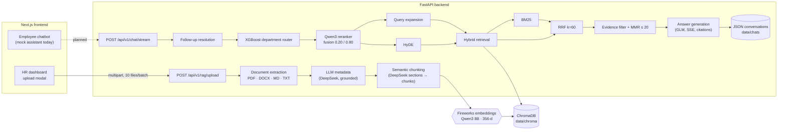
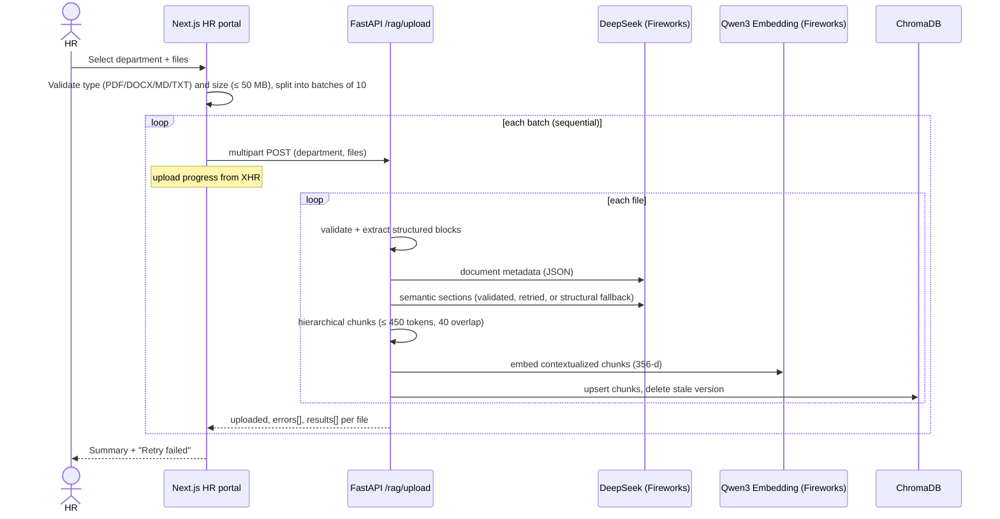
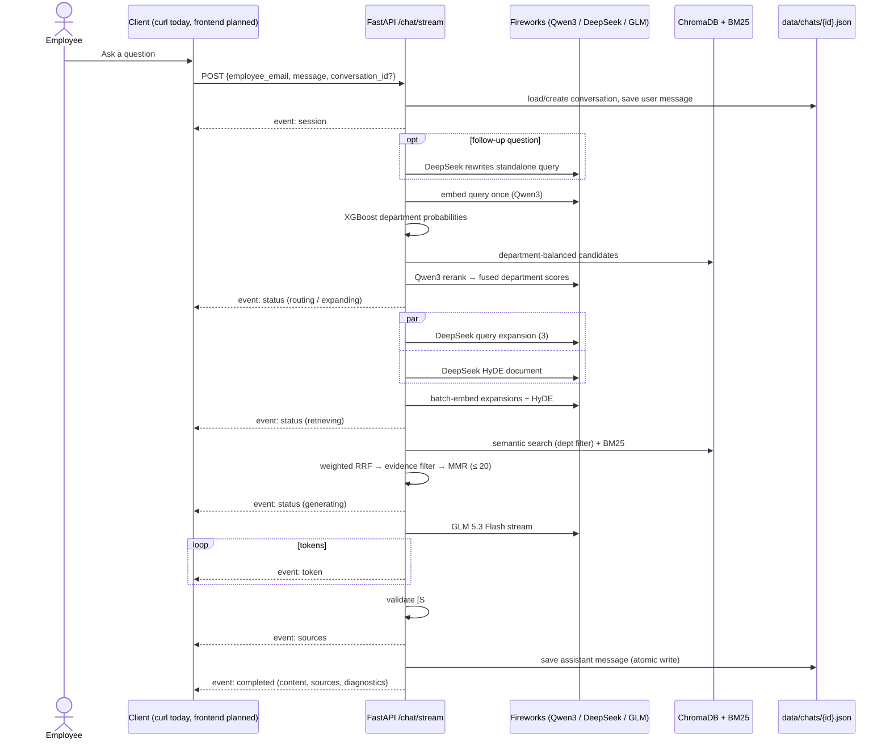

# ACME Onboard — Intelligent Enterprise Employee Onboarding Platform

**An AI-powered employee onboarding and enterprise knowledge retrieval platform, with
semantic document ingestion, department-aware routing and retrieval-augmented
generation.**

## Table of contents

- [Short description](#short-description)
- [Long description](#long-description)
- [How IBM Bob was used](#how-ibm-bob-was-used)
- [Technology & category tags](#technology--category-tags)
- [System architecture](#system-architecture)
- [Application workflows](#application-workflows)
- [Project structure](#project-structure)
- [Getting started](#getting-started)
- [API overview](#api-overview)
- [Screenshots](#screenshots)
- [Limitations](#limitations)
- [Further documentation](#further-documentation)

## Short description

ACME Onboard is a fictional enterprise onboarding platform with two parts: a document
management portal for HR and an AI-powered knowledge assistant for employees. HR uploads
onboarding documents by department. The backend understands their structure with an LLM,
splits them into semantic chunks, and indexes them for hybrid search. Employee questions
are routed to the right department and answered with retrieval-augmented generation,
with citations to the source documents.

## Long description

Onboarding knowledge in most companies is spread across HR policies, IT setup guides,
security rules and engineering handbooks. New employees struggle to know which document
applies, which department owns it, and whether an answer is current. HR and IT teams
answer the same questions again and again.

ACME Onboard puts that knowledge in one place. It is built around ACME Corp, a fictional
enterprise software company with 13 departments. A synthetic onboarding library for it
is included in [`docs/acme-corp-onboarding/`](docs/acme-corp-onboarding/).

**For HR (implemented):**

- HR signs in to a portal, picks a department and uploads PDF, DOCX, Markdown or TXT
  files. The frontend sends them in batches of 10 and shows real upload progress and a
  result for each file.
- The backend extracts each document's structure: headings, lists, tables and pages.
- DeepSeek V4.1 Flash generates grounded metadata and proposes semantic sections. The
  backend validates both against the source text, so the model cannot drop, duplicate
  or invent content.
- The sections become hierarchical, contextualized chunks. These are embedded with
  Qwen3 Embedding 8B and stored in a persistent ChromaDB collection under the department
  HR selected.
- Re-uploading is idempotent: an unchanged file is skipped, and a changed one replaces
  its previous version.

**For employees (backend implemented; frontend integration planned):**

- A question first goes through **department-aware routing**. A trained XGBoost
  classifier over query embeddings is combined with evidence from the Qwen3 reranker
  (weights 20/80).
- The backend then generates alternative search queries and a hypothetical answer
  document (HyDE), concurrently.
- It runs **hybrid retrieval**: dense vector search with department filters plus BM25
  keyword search, merged with weighted Reciprocal Rank Fusion. The candidates are
  filtered for evidence and diversified with Maximum Marginal Relevance.
- GLM 5.3 Flash streams a Markdown answer over Server-Sent Events. It is grounded in at
  most 20 source chunks, and every `[S#]` citation is checked against the sources it was
  given. When the documents don't contain the answer, the assistant says so.
- Each conversation is saved as a JSON file and can be listed, renamed and deleted.

The employee chat interface is complete, with history, suggested questions, Markdown and
citation chips. It currently answers from a **local mock assistant**. Connecting it to
the backend's streaming chat API is the next planned step.

## How IBM Bob Was Used

ACME Onboard was built with AI-assisted development throughout the engineering workflow,
from the first architecture decisions to integration testing and documentation.

**Architecture.** The work started by defining a two-tier architecture: a Next.js App
Router frontend and a modular FastAPI backend. The backend was organized into
single-purpose packages for Fireworks clients, semantic ingestion, routing, retrieval,
generation and chat, so each stage could be built and tested on its own.

**Frontend.** AI assistance was used to scaffold the Next.js 16 / Tailwind CSS 4 project
and build the dark navy enterprise design system. It also produced:

- the landing page;
- the mock HR and employee login flows;
- the HR dashboard and its accessible document upload modal (batching, progress,
  per-file errors, retry);
- the responsive employee chatbot interface, with conversation history and Markdown
  rendering.

**Backend.** The FastAPI application was set up with asynchronous endpoints,
environment-driven configuration, CORS for the frontend and strict upload limits.

**Document intelligence.** Development covered:

- structure-preserving extraction for PDF, DOCX, Markdown and TXT;
- DeepSeek-assisted metadata generation with grounding checks;
- hierarchical semantic chunking with coverage verification;
- idempotent ingestion into ChromaDB.

**Machine learning.** A synthetic dataset of 2,600 labelled onboarding questions was
generated to train an XGBoost department classifier on Qwen3 embeddings. The training
used a group-aware split, early stopping and temperature calibration. The classifier was
then combined with Qwen3 reranker evidence through weighted fusion.

**Advanced RAG.** The retrieval pipeline integrates the following Fireworks-hosted
steps:

- DeepSeek query expansion and HyDE;
- semantic search with metadata filters;
- BM25 keyword search;
- weighted reciprocal rank fusion;
- evidence filtering and MMR diversification.

**Conversational AI.** The backend chat service resolves follow-up questions and streams
GLM Markdown answers over Server-Sent Events. It validates document citations and
persists conversations as atomically written JSON files. The chat interface is complete
but still runs on a mock assistant; connecting it to this streaming API is in progress.

**Testing and documentation.** AI assistance supported:

- debugging and API contract alignment between the frontend and backend;
- an offline pytest suite with a mocked Fireworks API;
- opt-in live tests against the real API;
- local run instructions and this project documentation.

> **Author's IBM Bob notes:** _Additional IBM Bob usage notes to be added by the project
> author._
>
> **Supporting evidence:** IBM Bob session screenshots are provided in
> [`docs/bob_images.docx`](docs/bob_images.docx). _Placeholder for exported screenshots,
> e.g. `docs/images/ibm-bob-*.png`._

## Technology & category tags

**Technologies** (verified in `frontend/package.json`, `backend/pyproject.toml` and the
source code):

`Next.js` · `React` · `TypeScript` · `Tailwind CSS` · `react-markdown` · `Lucide` ·
`Python` · `FastAPI` · `Uvicorn` · `Pydantic` · `uv` · `ChromaDB` · `XGBoost` ·
`scikit-learn` · `NumPy` · `pandas` · `PyMuPDF` · `python-docx` · `rank-bm25` ·
`httpx` · `pytest` · `Ruff` · `Fireworks AI` · `DeepSeek V4.1 Flash` ·
`Qwen3 Embedding 8B` · `Qwen3 Reranker` · `GLM 5.3 Flash` · `RAG` · `HyDE` · `BM25` ·
`RRF` · `MMR` · `Server-Sent Events`

**Categories:**

`Artificial Intelligence` · `Generative AI` · `Enterprise AI` ·
`Retrieval-Augmented Generation` · `Natural Language Processing` ·
`Employee Onboarding` · `Knowledge Management` · `Full-Stack Development`

## System architecture



The solid lines are implemented. The dashed line (frontend chat → chat API) is planned;
the backend endpoint is implemented and can be used today through curl or the OpenAPI UI
at `/docs`. All model calls go to Fireworks AI from the backend only.

## Application workflows

### HR document ingestion



1. HR picks one of the 13 departments and selects files.
2. The frontend validates them and uploads batches of 10 in sequence.
3. For each file, the backend extracts headings, lists, tables and pages. DeepSeek adds
   grounded metadata and semantic section boundaries. The backend builds contextualized
   chunks from the original text, embeds them and stores them in ChromaDB with the
   department HR chose.
4. The response reports each file as `ingested`, `unchanged` or `failed`, with stage
   details.

### Employee AI chatbot



If nothing relevant is found, or the knowledge base is empty, GLM is not called: the
assistant streams a fixed message saying the answer isn't in the ACME documents. Errors
are sent as an `error` event with a user-safe message, and the assistant message is
saved as `failed` or `cancelled`.

## Project structure

```text
IBM_Bob/
├── README.md                     # this file
├── .gitignore                    # ignores **/.env* (keeps .env.example)
├── docs/
│   ├── acme-corp-onboarding/     # fictional ACME onboarding library (Markdown, 13 sections + metadata)
│   └── bob_images.docx           # IBM Bob session screenshots
├── frontend/                     # Next.js 16 app — see frontend/README.md
│   └── src/
│       ├── app/                  # routes: /, /hr/login, /hr/dashboard, /employee/login, /employee/dashboard
│       ├── components/           # auth, chat, hr (upload), landing, layout, ui
│       ├── hooks/                # useChat
│       ├── lib/                  # auth, validation, api/documents (upload client), chat, upload batching
│       └── types/                # auth, chat, documents
└── backend/                      # FastAPI service — see backend/README.md
    ├── src/
    │   ├── main.py, config.py, middleware.py
    │   ├── chroma/               # async ChromaDB wrapper
    │   └── rag/
    │       ├── fireworks/        # HTTP client, embeddings, reranker, LLM, SSE
    │       ├── semantic/         # metadata, segmentation, chunks
    │       ├── router/           # XGBoost router, fusion, training script, dataset, model, evaluation
    │       ├── preprocessing/    # query expansion, HyDE
    │       ├── retrieval/        # BM25, RRF, MMR, evidence filtering, hybrid retriever
    │       ├── generation/       # GLM streaming, context + citations, SSE framing
    │       ├── chat/             # conversation schemas, JSON storage, chat service + routes
    │       └── extraction.py, ingestion.py, routes.py, service.py, …
    └── tests/                    # pytest suite (Fireworks mocked) + opt-in live tests
```

## Getting started

### Prerequisites

- Python 3.12+ and [uv](https://docs.astral.sh/uv/)
- Node.js ≥ 20.9 and npm
- A Fireworks AI API key. It is required for upload, routing and chat; without it the
  server still starts, but those endpoints return 503.

### 1. Backend

```bash
cd backend
uv sync
cp .env.example .env        # then set FIREWORKS_API_KEY=... in .env (never commit it)
uv run uvicorn src.main:app --reload --port 8000
```

Check <http://localhost:8000/health> and the API docs at <http://localhost:8000/docs>.

### 2. Frontend

```bash
cd frontend
npm install
# optional: defaults to http://localhost:8000
echo "NEXT_PUBLIC_API_BASE_URL=http://localhost:8000" > .env.local
npm run dev
```

Open <http://localhost:3000>.

- **HR:** sign in at `/hr/login` with any `@hr.com` email, then upload documents. The
  files in `docs/acme-corp-onboarding/` work as sample data.
- **Employee:** sign in at `/employee/login` with any `@acmecorp.com` email.

Uploading calls Fireworks and uses API credits, so start with a few small files.

### 3. Checks

```bash
cd backend  && uv run pytest && uv run ruff check .
cd frontend && npm run lint && npx tsc --noEmit && npm run build
```

## API overview

| Method | Route | Purpose |
|---|---|---|
| GET | `/health` | Liveness check |
| POST | `/api/v1/rag/upload` | Upload ≤ 10 documents for one department (multipart `department`, `files`) |
| POST | `/api/v1/rag/route` | Fused department routing for a query (inspection / debugging) |
| POST | `/api/v1/chat` | Create a conversation |
| GET | `/api/v1/chat?employee_email=` | List an employee's conversations |
| GET | `/api/v1/chat/{id}?employee_email=` | Get a conversation with its messages |
| PATCH | `/api/v1/chat/{id}` | Rename a conversation |
| DELETE | `/api/v1/chat/{id}?employee_email=` | Delete a conversation |
| POST | `/api/v1/chat/stream` | Ask a question; streamed answer as Server-Sent Events |

Request and response details are in the
[backend API reference](backend/README.md#25-api-endpoint-reference).

## Screenshots

> Screenshots of the application have not been added to the repository yet.

| View | Screenshot |
|---|---|
| Landing page | _Placeholder: `docs/images/landing.png`_ |
| HR dashboard | _Placeholder: `docs/images/hr-dashboard.png`_ |
| Document upload modal | _Placeholder: `docs/images/upload-modal.png`_ |
| Employee chatbot | _Placeholder: `docs/images/employee-chat.png`_ |
| RAG response with citations | _Placeholder: `docs/images/rag-citations.png`_ |

## Limitations

This is a **demonstration project**. It is not production-secure.

- **Mock authentication.** There are no passwords, and the login only checks the email
  domain (`@hr.com` for HR, `@acmecorp.com` for employees). The session lives in
  `localStorage` and route guards run in the browser only. The backend trusts the
  `employee_email` it receives and has no authentication.
- **Chat frontend is mocked.** The employee chat uses canned demo answers and keeps its
  history in `localStorage`. The real streaming RAG chat and server-side history exist
  in the backend, but the frontend isn't connected to them yet.
- **Local storage only.** ChromaDB and the conversation JSON files live on the backend's
  local disk, and there is one process with in-memory locks. Nothing is replicated,
  backed up or encrypted.
- **Synchronous ingestion.** An upload request waits until each file is processed. There
  is no background queue, no document listing or deletion, and no OCR for scanned PDFs.
- **Model quality.** The XGBoost router's recorded held-out accuracy is 0.81 (top-3:
  0.955), so some questions are misrouted, which the pipeline tries to recover from by
  broadening the search. The evidence thresholds are uncalibrated defaults. Answers are
  AI-generated and should be checked against the cited documents.
- **Fictional data.** ACME Corp and all its documents are fictional.

## Further documentation

- [Frontend README](frontend/README.md): pages, components, upload client, design
  system, planned SSE integration.
- [Backend README](backend/README.md): ingestion, routing, retrieval, generation,
  configuration, API reference, tests.
- [ACME onboarding library](docs/acme-corp-onboarding/README.md): the fictional sample
  knowledge base.
