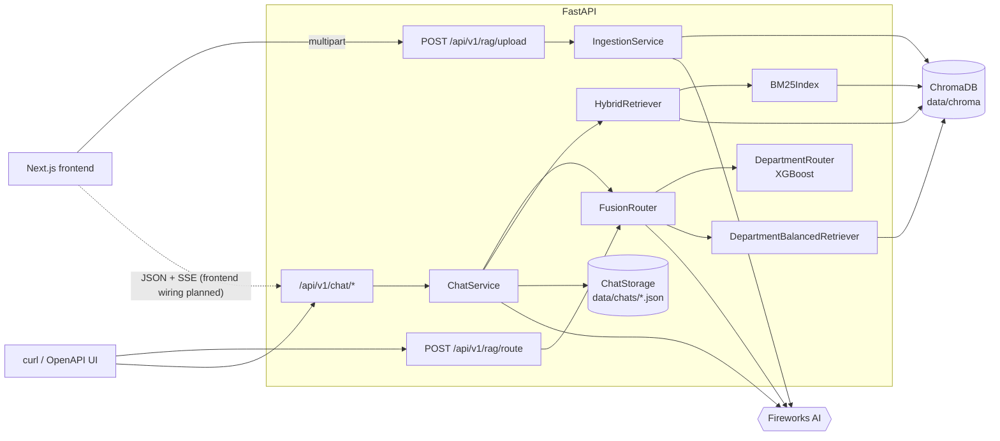
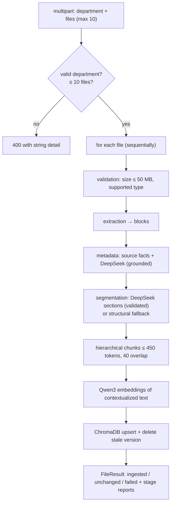
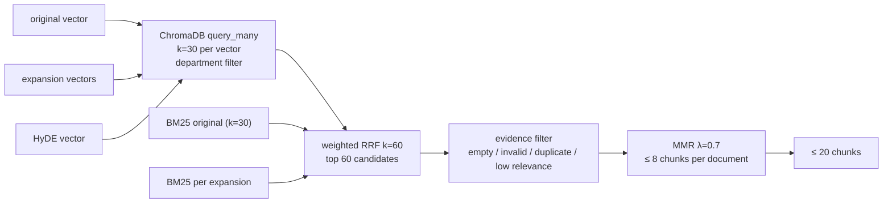

# ACME Onboard — Backend

The FastAPI service behind ACME Onboard. It ingests HR onboarding documents into a
local ChromaDB knowledge base and answers employee questions through a streamed,
department-aware RAG pipeline. All model inference goes through the Fireworks AI API.

> This is a hackathon demo built around a fictional company. It has no authentication,
> and it stores data on the local disk. See [Current limitations](#30-current-limitations).

## Table of contents

1. [Backend overview](#1-backend-overview)
2. [Technology stack](#2-technology-stack)
3. [Directory structure](#3-directory-structure)
4. [Module responsibilities](#4-module-responsibilities)
5. [FastAPI application architecture](#5-fastapi-application-architecture)
6. [Configuration and environment variables](#6-configuration-and-environment-variables)
7. [HR document ingestion](#7-hr-document-ingestion)
8. [Document extraction](#8-document-extraction)
9. [LLM-assisted metadata generation](#9-llm-assisted-metadata-generation)
10. [Semantic chunking](#10-semantic-chunking)
11. [Embedding generation](#11-embedding-generation)
12. [ChromaDB storage](#12-chromadb-storage)
13. [XGBoost training and inference](#13-xgboost-training-and-inference)
14. [Qwen3 reranker](#14-qwen3-reranker)
15. [Weighted department fusion](#15-weighted-department-fusion)
16. [Query expansion](#16-query-expansion)
17. [HyDE](#17-hyde)
18. [Hybrid retrieval](#18-hybrid-retrieval)
19. [BM25](#19-bm25)
20. [Reciprocal Rank Fusion](#20-reciprocal-rank-fusion)
21. [Maximum Marginal Relevance](#21-maximum-marginal-relevance)
22. [Final LLM generation](#22-final-llm-generation)
23. [SSE streaming](#23-sse-streaming)
24. [JSON chat session persistence](#24-json-chat-session-persistence)
25. [API endpoint reference](#25-api-endpoint-reference)
26. [Dependency installation with uv](#26-dependency-installation-with-uv)
27. [Running the application](#27-running-the-application)
28. [Running tests](#28-running-tests)
29. [Troubleshooting](#29-troubleshooting)
30. [Current limitations](#30-current-limitations)

---

## 1. Backend overview

The backend covers two workflows:

- **HR ingestion.** `POST /api/v1/rag/upload` takes up to 10 files (PDF, DOCX,
  Markdown, TXT) along with the department HR selected. Each file goes through these
  steps:
  1. Its structure is extracted.
  2. DeepSeek V4.1 Flash enriches the metadata and suggests semantic sections.
  3. The file is split into hierarchical chunks.
  4. The chunks are embedded with Qwen3 Embedding 8B at 356 dimensions.
  5. The chunks are stored in a persistent ChromaDB collection.
- **Employee chat.** `POST /api/v1/chat/stream` answers a question as Server-Sent
  Events. The pipeline runs these steps:
  1. Resolve follow-up questions against the conversation history.
  2. Route to a department with XGBoost combined with the Qwen3 reranker.
  3. Generate DeepSeek query expansions and a HyDE document, concurrently.
  4. Run hybrid retrieval: dense search, metadata filters and BM25, fused with RRF.
  5. Filter the candidates for evidence and diversify them with MMR (at most 20
     chunks).
  6. Stream a GLM 5.3 Flash Markdown answer with validated `[S#]` citations.

  Each conversation is saved as one JSON file.

Everything on the request path is `async`. Blocking work (ChromaDB, parsing, BM25,
XGBoost, file I/O) is moved to worker threads with `asyncio.to_thread`, and concurrency
toward Fireworks is bounded by semaphores.

## 2. Technology stack

| Area | Technology (from `pyproject.toml`) |
|---|---|
| Runtime | Python ≥ 3.12 (`.python-version`), [uv](https://docs.astral.sh/uv/) |
| Web | FastAPI, Uvicorn (`uvicorn[standard]`), python-multipart |
| Config | pydantic, pydantic-settings, python-dotenv |
| HTTP to Fireworks | httpx (async); the `openai` package is a declared dependency |
| Vector store | ChromaDB (persistent, local) |
| Lexical search | rank-bm25 |
| ML | XGBoost, scikit-learn, NumPy, pandas, joblib, matplotlib (training plots) |
| Document parsing | PyMuPDF (PDF), python-docx (DOCX), python-frontmatter (Markdown) |
| Dev | pytest, pytest-asyncio, ruff |

`sentence-transformers` is still a declared dependency. It was used by the v1 router
(`all-MiniLM-L6-v2`, recorded in `model_metadata.json`). The current v2 router uses
Fireworks embeddings.

**Fireworks models (defaults in `src/config.py`):**

| Purpose | Model id |
|---|---|
| Embeddings | `fireworks/qwen3-embedding-8b` (356 dims, L2-normalized client-side) |
| Reranker | `fireworks/qwen3-reranker-8b` (from `.env.example`; there is no default in code, so it must be set) |
| Metadata, segmentation, query expansion, HyDE, follow-up resolution | `accounts/fireworks/models/deepseek-v4p1-flash` |
| Streamed chat answer | `accounts/fireworks/models/glm-5p3-flash` |

## 3. Directory structure

```text
backend/
├── pyproject.toml / uv.lock      # dependencies, ruff and pytest config
├── .env.example                  # every setting with its default (copy to .env)
├── data/
│   ├── chroma/                   # persistent ChromaDB (gitignored)
│   ├── chats/                    # conversation JSON files (created on first use)
│   └── documents/                # unused placeholder (uploads are never written to disk)
├── src/
│   ├── main.py                   # FastAPI app, lifespan, CORS, routers, /health
│   ├── config.py                 # Settings (pydantic-settings, reads .env)
│   ├── middleware.py             # request-body size limit for uploads
│   ├── chroma/client.py          # async ChromaDB wrapper
│   └── rag/
│       ├── routes.py             # /rag/upload, /rag/route
│       ├── schemas.py            # upload / routing response models
│       ├── service.py            # builds all long-lived services at startup
│       ├── embeddings.py         # Fireworks client factories
│       ├── departments.py        # the 13 canonical departments
│       ├── extraction.py         # PDF / DOCX / MD / TXT → structured blocks
│       ├── ingestion.py          # ingestion orchestrator (idempotent)
│       ├── chunking.py           # passage formatting for retrieval components
│       ├── retriever.py          # department-balanced retrieval (for routing)
│       ├── prompts.py            # shared prompt text
│       ├── fireworks/            # client (retries, SSE), embeddings, reranker, LLM
│       ├── semantic/             # metadata, segmentation, chunks, tokens, serialization
│       ├── router/               # XGBoost router, fusion router, training script,
│       │   ├── dataset.json      #   synthetic training data (2,600 queries)
│       │   ├── models/           #   active model + archive
│       │   └── evaluation/       #   metrics, report and plots of the active model
│       ├── preprocessing/        # query expansion, HyDE (+ standalone pipeline)
│       ├── retrieval/            # BM25, RRF, MMR, evidence filtering, hybrid retriever
│       ├── generation/           # GLM streaming, context builder, citations, SSE framing
│       └── chat/                 # schemas, JSON storage, follow-ups, service, router
└── tests/
    ├── conftest.py               # FakeFireworks (httpx.MockTransport) + fixtures
    └── rag/                      # 14 test modules
```

## 4. Module responsibilities

| Module | Responsibility |
|---|---|
| `src/main.py` | Builds the app and runs the lifespan: `create_services` sets `app.state.rag`, `app.state.chat` and `app.state.chat_storage`. Adds CORS and the upload body limit, mounts `/api/v1`, and serves `/health`. |
| `src/rag/service.py` | `create_services()` builds one Fireworks client, embedder, ChromaDB store, XGBoost router, fusion router, ingestion service and chat service. It returns `None` when `FIREWORKS_API_KEY` is empty, and the RAG endpoints then return 503. |
| `src/rag/fireworks/client.py` | A shared `httpx.AsyncClient` with auth, timeouts and bounded exponential-backoff retries (429, 5xx, timeouts, connection errors). `stream_sse()` retries only before the first byte of a stream. |
| `src/rag/fireworks/embeddings.py` | Batched, concurrency-limited embeddings. Checks the dimensions strictly, adds the query instruction and L2-normalizes the vectors. |
| `src/rag/fireworks/reranker.py` | The Qwen3 reranker client. Scores are relative evidence, not probabilities. |
| `src/rag/fireworks/llm.py` | `FireworksLLM`: DeepSeek chat completions with Pydantic-validated JSON output. |
| `src/rag/extraction.py` | Parses a file into ordered `Block`s (heading, paragraph, list, table, code) with heading paths, pages and offsets. |
| `src/rag/semantic/*` | Document metadata (`metadata.py`), LLM segmentation (`segmentation.py`), chunk building and coverage checks (`chunks.py`), the approximate token counter (`tokens.py`), and flattening metadata for ChromaDB (`serialization.py`). |
| `src/rag/ingestion.py` | `IngestionService.ingest_file()`: validate → extract → metadata → chunk → embed → persist, with a status recorded for each stage. |
| `src/chroma/client.py` | `ChromaStore`: async upsert/replace, `query`, batched `query_many`, `get_embeddings`, paginated `all_chunks`, and a `generation` counter that changes on every write. |
| `src/rag/router/router.py` | `DepartmentRouter`: XGBoost inference over query embeddings, with temperature calibration. |
| `src/rag/router/fusion.py` | `FusionRouter`: combines the XGBoost prior with reranker evidence per department. |
| `src/rag/router/training_router.py` | Trains, evaluates and promotes the XGBoost model (CLI). |
| `src/rag/retriever.py` | `DepartmentBalancedRetriever`: one filtered search per department plus a global search (used for routing evidence). |
| `src/rag/preprocessing/query_expansion.py`, `hyde.py` | DeepSeek query expansion and HyDE document generation. |
| `src/rag/preprocessing/pipeline.py`, `fusion.py` | An earlier standalone preprocessing pipeline (routing, expansion and HyDE). Covered by tests, but **not mounted on any HTTP route**. The chat service uses `router/fusion.py` instead. |
| `src/rag/retrieval/*` | `bm25.py`, `fusion.py` (RRF), `mmr.py`, `filtering.py` (department plan and evidence filter), and `hybrid.py` (the `HybridRetriever` orchestrator). |
| `src/rag/generation/*` | `llm.py` (GLM streaming), `context_builder.py` (sources, token budget, citation validation), `prompts.py`, `streaming.py` (SSE framing and headers). |
| `src/rag/chat/*` | `schemas.py`, `storage.py` (atomic JSON files), `context.py` (history window, follow-up resolver, titles), `service.py` (the streamed chat turn), `router.py` (HTTP). |

## 5. FastAPI application architecture



The services are built once in the lifespan and shared by all requests. When they are
unavailable because no API key is configured, the upload, route and chat-stream
endpoints return `503` with a plain-text `detail`. The conversation CRUD endpoints keep
working because they only need the JSON storage.

**CORS** comes from `CORS_ORIGINS` (a JSON list; the default is `http://localhost:3000`
and `http://127.0.0.1:3000`). `BodySizeLimitMiddleware` rejects upload requests larger
than `UPLOAD_MAX_REQUEST_BYTES` with a 413.

## 6. Configuration and environment variables

All settings live in [`src/config.py`](src/config.py) and are read from the environment
or from `backend/.env`. [`.env.example`](.env.example) lists every variable with its
default.

### Fireworks credentials

```bash
cp .env.example .env
# edit .env and set:
FIREWORKS_API_KEY=your-fireworks-api-key
```

- The key is a `SecretStr`, used only server-side and never returned by any endpoint.
- `.env` and `.env.*` are gitignored (`!.env.example` is kept), and `.env` is excluded
  in `.vercelignore`.
- Never put the key in a `NEXT_PUBLIC_*` variable.
- On a hosting platform, set it as a server-side environment variable.

### Main groups (defaults)

| Group | Variables |
|---|---|
| App | `APP_NAME`, `ENVIRONMENT=development`, `CORS_ORIGINS` |
| Fireworks client | `FIREWORKS_BASE_URL=https://api.fireworks.ai/inference/v1`, `FIREWORKS_TIMEOUT_SECONDS=30`, `FIREWORKS_MAX_RETRIES=4` |
| Embeddings | `FIREWORKS_EMBEDDING_MODEL=fireworks/qwen3-embedding-8b`, `FIREWORKS_EMBEDDING_DIMENSIONS=356`, `FIREWORKS_EMBEDDING_BATCH_SIZE=32`, `FIREWORKS_EMBEDDING_MAX_CONCURRENCY=4` |
| Reranker | `FIREWORKS_RERANKER_MODEL` (empty in code, which disables fusion routing), `FIREWORKS_RERANKER_URL`, `FIREWORKS_RERANKER_MAX_CANDIDATES=40` |
| DeepSeek | `FIREWORKS_LLM_MODEL=accounts/fireworks/models/deepseek-v4p1-flash`, `FIREWORKS_LLM_TIMEOUT_SECONDS=45`, `FIREWORKS_LLM_MAX_TOKENS=1024`, `FIREWORKS_LLM_TEMPERATURE=0.3` |
| Routing | `FUSION_XGBOOST_WEIGHT=0.20`, `FUSION_RERANKER_WEIGHT=0.80` (the two must add up to 1.0); `QUERY_EXPANSION_COUNT=3`, `HYDE_ENABLED=true` |
| Standalone pipeline only | `FUSION_RETRIEVAL_CANDIDATES=40`, `FUSION_MAX_ALTERNATIVES=2` |
| Chat answer (GLM) | `FIREWORKS_ANSWER_MODEL=accounts/fireworks/models/glm-5p3-flash`, `FIREWORKS_ANSWER_MAX_TOKENS=2048`, `FIREWORKS_ANSWER_TEMPERATURE=0.2`, `FIREWORKS_ANSWER_TIMEOUT_SECONDS=60`, `FIREWORKS_ANSWER_REASONING_EFFORT=` (empty means the parameter is not sent) |
| Chat preprocessing | `CHAT_PREPROCESS_MAX_TOKENS=2048`, `CHAT_PREPROCESS_REASONING_EFFORT=low`, `CHAT_PREPROCESS_TIMEOUT_SECONDS=30` |
| Chat | `CHAT_DIR=data/chats`, `CHAT_HISTORY_TURNS=4`, `CHAT_FOLLOWUP_MODE=auto` (`auto`, `always` or `never`), `CHAT_MAX_CONCURRENT_STREAMS=8`, `CHAT_CONTEXT_TOKEN_BUDGET=6000`, `CHAT_DEPARTMENT_FILTER=routed` (`routed` or `none`), `CHAT_LOW_CONFIDENCE_THRESHOLD=0.55`, `CHAT_MAX_FILTER_DEPARTMENTS=3` |
| Retrieval | `RETRIEVAL_SEMANTIC_K=30`, `RETRIEVAL_BM25_K=30`, `RETRIEVAL_FUSION_CANDIDATES=60`, `RETRIEVAL_TOP_K=20` (maximum 20) |
| RRF / MMR | `RRF_K=60`, `RRF_WEIGHT_ORIGINAL=1.0`, `RRF_WEIGHT_EXPANSIONS=1.0`, `RRF_WEIGHT_HYDE=0.7`, `RRF_WEIGHT_BM25=1.0`, `RRF_WEIGHT_BM25_EXPANSIONS=0.3`, `MMR_LAMBDA=0.7`, `MMR_DUPLICATE_THRESHOLD=0.97`, `MMR_MAX_CHUNKS_PER_DOCUMENT=8` |
| Evidence | `EVIDENCE_MIN_SIMILARITY=0.35`, `EVIDENCE_MIN_BM25=3.0`, `EVIDENCE_SUFFICIENT_SIMILARITY=0.45`, `EVIDENCE_SUFFICIENT_BM25=6.0` |
| Storage | `CHROMA_PERSIST_DIR=data/chroma`, `CHROMA_COLLECTION=acme_onboarding_v2`, `DOCUMENTS_DIR=data/documents` (currently unused) |
| Upload limits | `UPLOAD_MAX_FILES=10`, `UPLOAD_MAX_FILE_BYTES=52428800` (50 MB), `UPLOAD_MAX_REQUEST_BYTES=209715200` (200 MB) |
| Ingestion LLM | `INGESTION_LLM_ENABLED=true`, `INGESTION_LLM_MAX_TOKENS=8192`, `INGESTION_LLM_TEMPERATURE=0.0`, `INGESTION_LLM_REASONING_EFFORT=low`, `INGESTION_LLM_TIMEOUT_SECONDS=120`, `INGESTION_LLM_MAX_ATTEMPTS=3`, `INGESTION_LLM_MAX_CONCURRENCY=2`, `INGESTION_METADATA_MAX_CHARS=20000`, `INGESTION_SEGMENTATION_WINDOW_CHARS=24000`, `INGESTION_SEGMENTATION_MAX_WINDOWS=12`, `INGESTION_BLOCK_PREVIEW_CHARS=240` |
| Chunks | `SEMANTIC_CHUNK_MAX_TOKENS=450`, `SEMANTIC_CHUNK_OVERLAP_TOKENS=40` (approximate tokens) |

Two further settings are defined in `config.py` but left out of the template on purpose:
`FIREWORKS_QUERY_INSTRUCTION` (the Qwen3 query instruction) and
`FIREWORKS_RERANKER_TASK`. Changing the query instruction invalidates the trained
router.

## 7. HR document ingestion



- **Department.** It must be one of the 13 departments in
  [`src/rag/departments.py`](src/rag/departments.py). The department chosen by HR is
  authoritative; DeepSeek never overrides it, and the XGBoost router is not used to
  classify documents.
- **Per-file outcome.** Request-level problems (bad department, no files, more than 10
  files) return a non-2xx status with a string `detail`. Per-file problems return
  `200`, with the failing file listed in `errors` and `results[].status = "failed"`.
- **Idempotency.** `document_id` is a hash of (department, lower-cased filename).
  `document_version` is a hash of the file bytes plus the pipeline configuration.
  - Re-uploading identical content gives `unchanged`.
  - A changed file replaces its previous chunks.
  - A version built with the structural fallback is re-processed once DeepSeek is
    available again.
- **Storage.** Uploaded bytes stay in memory for the length of the request and are
  never written to disk. Only extracted text, embeddings and metadata are stored.
- **Stages** reported for each file: `validation`, `extraction`, `metadata`,
  `chunking`, `embedding`, `persistence`, each with a `status` and a `detail`.

## 8. Document extraction

[`src/rag/extraction.py`](src/rag/extraction.py) supports `.pdf`, `.docx`, `.md`,
`.markdown` and `.txt`.

- **PDF (PyMuPDF).**
  - Headings are inferred from font sizes, and running headers and footers are
    removed.
  - Page numbers are kept on every block.
  - OCR is not supported: a PDF with no text layer is rejected with a clear error.
- **DOCX (python-docx).** Heading styles, lists and tables, plus the core document
  properties.
- **Markdown.** Front matter via `python-frontmatter`, ATX headings, lists, tables
  and code fences.
- **TXT.** Paragraph blocks.

A file whose extension doesn't match its content (for example a `.pdf` that isn't a
valid PDF) is rejected. Parsing runs in a worker thread.

## 9. LLM-assisted metadata generation

[`src/rag/semantic/metadata.py`](src/rag/semantic/metadata.py) combines facts read from
the file (front matter, document properties) with DeepSeek enrichment: summary, owner,
secondary departments, referenced systems, identifiers and so on. The following rules
apply:

- Facts from the file take precedence over LLM output, and disagreements are recorded
  in `conflicts`.
- Factual LLM fields (owner, version, dates) must quote verbatim evidence from the
  document. Referenced identifiers must appear in the text literally. Anything that
  can't be verified is dropped and listed in `ungrounded_fields`.
- If DeepSeek fails, or keeps returning invalid JSON after
  `INGESTION_LLM_MAX_ATTEMPTS`, the document keeps its source-only metadata
  (`llm_status="fallback"`) and ingestion continues.

The stored metadata keys show where each value came from: `src_*` was read from the
file, `llm_*` was generated by DeepSeek, and unprefixed keys are system values.

## 10. Semantic chunking

- **Segmentation.** DeepSeek sees block previews (`INGESTION_BLOCK_PREVIEW_CHARS`) and
  returns contiguous block ranges; see
  [`segmentation.py`](src/rag/semantic/segmentation.py).
  - The ranges must cover every block exactly once, in order, and may not merge sibling
    headings.
  - Invalid answers are retried with the problems fed back to the model.
  - If a window still fails, its blocks fall back to structural sections, one per
    heading.
  - Long documents are processed in windows of up to 24,000 characters (at most 12 per
    document).
- **Chunks** ([`chunks.py`](src/rag/semantic/chunks.py)). Chunks are at most
  `SEMANTIC_CHUNK_MAX_TOKENS=450` approximate tokens, with 40 tokens of overlap.
  - Oversized sections are split at sub-headings first, then at block boundaries (a
    lead-in line ending in ":" stays with its list or table), and finally by tokens.
  - `verify_coverage` guarantees that every character of the source is covered exactly
    once.
- **Tokens** ([`tokens.py`](src/rag/semantic/tokens.py)) are approximated as
  `\w+|[^\w\s]`. This is deterministic and works offline. Real BPE counts are typically
  1.1–1.4× higher.
- **Chunk text** is always the original extracted text. The embedding input is a
  *contextualized* version:

  ```text
  Document: <title>
  Department: <department>
  Section: <top heading>
  Subsection: <deeper > headings>
  Part: 2 of 3            (only for split sections)

  <optional DeepSeek section context>

  <original chunk content>
  ```

## 11. Embedding generation

[`FireworksEmbeddings`](src/rag/fireworks/embeddings.py):

- **Model and dimensions.** Uses `fireworks/qwen3-embedding-8b` with
  `dimensions=356`. Every returned vector is checked for length; nothing is truncated or
  padded.
- **Normalization.** Vectors are L2-normalized client-side.
- **Queries vs documents.** Queries get the Qwen3 instruction prefix
  (`FIREWORKS_QUERY_INSTRUCTION`); documents are embedded as-is.
- **Batching.** Batches of `FIREWORKS_EMBEDDING_BATCH_SIZE=32`, with at most
  `FIREWORKS_EMBEDDING_MAX_CONCURRENCY=4` requests in flight.
- **Reuse in chat.** The original query is embedded **once**, and that vector feeds the
  XGBoost router, the fusion retrieval and hybrid search. The expansion queries and
  the HyDE document are embedded together in a single batched call.

## 12. ChromaDB storage

- **Collection.** A persistent client at `CHROMA_PERSIST_DIR=data/chroma`, collection
  `CHROMA_COLLECTION=acme_onboarding_v2`, using cosine distance
  (`similarity = 1 - distance`).
- **Model check.** The collection metadata records the embedding model and its
  dimensions. Opening it with a different model or size fails loudly, so embedding
  spaces are never mixed.
- **Writes.** Writes are serialized by an `asyncio.Lock`. `replace_document` upserts the
  new chunks, then deletes the stale ones and increments `generation`, which is how the
  BM25 index knows to rebuild.
- **Metadata values** are scalars only. Lists and dicts are stored as JSON strings
  under `<name>_json`, and `None` values are omitted. The fields used at query time are
  `department`, `title`, `heading_path_text`, `section_heading`, `doc_version`,
  `source_filename`, `page_start`/`page_end` and `document_id`.

To reset the knowledge base, stop the server and delete `data/chroma/`.

## 13. XGBoost training and inference

**Inference** ([`router.py`](src/rag/router/router.py)): `DepartmentRouter` loads the
following from `src/rag/router/models/`:

- `department_router.json` (the XGBoost model)
- `label_encoder.joblib`
- `model_metadata.json`

On load it checks that the embedding model, dimensions and query instruction in the
metadata match the current settings, and raises `RouterCompatibilityError` if they
don't. Probabilities are temperature-calibrated.

**Training** ([`training_router.py`](src/rag/router/training_router.py)), from
`backend/`:

```bash
uv run python -m src.rag.router.training_router --estimate-only  # API usage/cost estimate only
uv run python -m src.rag.router.training_router                  # train, evaluate, promote
uv run python -m src.rag.router.training_router --show           # also open the plots
# other flags: --dataset, --model-dir, --evaluation-dir, --seed, --no-cache
```

The training pipeline:

1. Validates `dataset.json`, which holds 2,600 synthetic queries (200 per department)
   with `id`, `query`, `department`, `difficulty`, `topic` and `source_group`.
2. Embeds the queries with Fireworks, cached under `.cache/`.
3. Makes a group-aware 70/15/15 split on `source_group` (seed 42).
4. Trains XGBoost `multi:softprob` with early stopping on validation `mlogloss`.
5. Fits temperature scaling on the validation split.
6. Evaluates once on the held-out test split.
7. Writes the artifacts to staging directories and promotes them only after a
   successful reload check. The previous model is archived under `archive/v<version>`.

Training calls the paid embedding API, so run `--estimate-only` first.

**Active model:** metrics recorded in `models/model_metadata.json` and
`evaluation/classification_report.txt`, v2.0.0, trained 2026-09-26.

| Split | Accuracy | Top-3 accuracy | Macro F1 |
|---|---|---|---|
| Validation (391) | 0.8645 | 0.9821 | 0.8648 |
| Test (378) | 0.8095 | 0.9550 | 0.8066 |

The most frequent test confusion is Information Security → IT Operations (12 of 30). The
report also notes a train/validation gap, meaning the model overfits; early stopping
limits it. The plots are in [`src/rag/router/evaluation/`](src/rag/router/evaluation/).

## 14. Qwen3 reranker

[`FireworksReranker`](src/rag/fireworks/reranker.py) calls `{FIREWORKS_BASE_URL}/rerank`,
or `FIREWORKS_RERANKER_URL` if that is set.

- **Model choice.** `.env.example` uses the serverless `fireworks/qwen3-reranker-8b`.
  The template notes that the 0.6B reranker needs a dedicated deployment.
- **Input.** Each request sends at most `FIREWORKS_RERANKER_MAX_CANDIDATES=40` passages,
  prefixed with `FIREWORKS_RERANKER_TASK`.
- **Scores** are in [0, 1] but are not calibrated. They are used as relative evidence.

## 15. Weighted department fusion

[`FusionRouter`](src/rag/router/fusion.py) scores each department with:

```text
final(d) = 0.20 · calibrated_xgboost_probability(d) + 0.80 · normalized_reranker_evidence(d)
```

1. Embed the query once; the vector goes to both XGBoost and ChromaDB.
2. Run department-balanced retrieval: `per_department_k=3` for each of the 13
   departments, plus `global_k=20` global hits. Nothing is pre-filtered by XGBoost.
3. Rerank at most 40 candidates. Aggregate the scores per department (`max`) and
   normalize them (`clip`).
4. If the evidence is weak (best score below 0.05), rerank a wider global search
   (`fallback_global_k=50`) instead.
5. A department with no retrieved chunks, for example because no documents have been
   uploaded for it, is scored from XGBoost alone (`missing_evidence="xgboost_only"`).
6. Select the primary department, plus at most 3 departments within
   `selection_margin=0.10` of it.

If `FIREWORKS_RERANKER_MODEL` is empty, fusion is disabled: `/rag/route` returns 503 and
chat falls back to XGBoost-only routing.

**How chat uses the route.** The route is turned into a metadata filter by
`plan_departments` in `retrieval/filtering.py`. The filter starts with the primary and
selected departments. If the top fused score is below
`CHAT_LOW_CONFIDENCE_THRESHOLD=0.55`, or the router fell back or had no evidence, the
next-best predictions are added, up to `CHAT_MAX_FILTER_DEPARTMENTS=3` departments.
Setting `CHAT_DEPARTMENT_FILTER=none` turns the filter off.

## 16. Query expansion

[`query_expansion.py`](src/rag/preprocessing/query_expansion.py) asks DeepSeek for
`QUERY_EXPANSION_COUNT=3` alternative search queries as validated JSON.

- The results are deduplicated and capped at 3.
- Recent conversation context is included for follow-up questions.
- If the call fails, chat continues without expansions. The failure is reported in the
  `completed` diagnostics.

## 17. HyDE

[`hyde.py`](src/rag/preprocessing/hyde.py) asks DeepSeek to write a short hypothetical
internal article that would answer the question.

- It runs **concurrently** with query expansion (`asyncio.gather`), and its embedding is
  batched together with the expansions.
- The HyDE vector is only one retrieval signal, with RRF weight 0.7. Its similarity is
  **never** used as evidence of relevance, and its text is never shown to the answer
  model.
- It is disabled with `HYDE_ENABLED=false`.

## 18. Hybrid retrieval

[`HybridRetriever`](src/rag/retrieval/hybrid.py), per attempt:



- **One batch.** All query vectors go into a single `query_many` call, which runs
  concurrently with the BM25 searches.
- **Broadening.** The retriever makes up to three attempts:
  1. With the routed department filter.
  2. With no filter, if a filter was used.
  3. With no filter and the original query only, if expansions or HyDE were used.

  It stops at the first attempt with sufficient evidence. If no attempt is
  sufficient, it returns the best candidates with `sufficient=false`, and the answer is
  qualified accordingly.
- **Evidence.** For each candidate the retriever computes the maximum cosine
  similarity against the original and expansion vectors (not HyDE), and the BM25
  score.
  - A candidate is kept if its similarity is at least 0.35 or its BM25 score is at
    least 3.0.
  - The evidence is *sufficient* if some candidate reaches similarity 0.45 or BM25
    6.0.
- **Empty collection.** Reported as `no_documents`. The GLM model is not called in this
  case, and a fixed, honest answer is streamed instead.

## 19. BM25

[`bm25.py`](src/rag/retrieval/bm25.py):

- **Index.** Built over `title + heading path + chunk text`, using the same chunk ids as
  ChromaDB.
- **Tokenizer.** Keeps compound identifiers (`acme-payments-api`, `sec-101`, `v2.3`)
  and also indexes their parts. Common stopwords are removed.
- **IDF.** Uses the non-negative Lucene form `log(1 + (N − n + 0.5)/(n + 0.5))`, so a
  knowledge base with only one or two documents still produces lexical matches.
- **Refresh.** The index is rebuilt lazily in a worker thread when the store's
  `generation` changes. A search then waits for the rebuild; there is no background job.
- **Filtering.** Department filtering masks scores. Only chunks with a positive score
  are returned.

## 20. Reciprocal Rank Fusion

[`fusion.py`](src/rag/retrieval/fusion.py):

```text
score(chunk) = Σ over lists  weight(list) / (k + rank_in_list),   k = 60
```

| List | Weight |
|---|---|
| Semantic, original query | 1.0 |
| Semantic, expansions | 1.0 **in total**, split evenly across the expansions |
| Semantic, HyDE | 0.7 |
| BM25, original query | 1.0 |
| BM25, expansions | 0.3 in total, split evenly |

Splitting the weight keeps three expansions from outvoting the original query. A
duplicate within one list counts once, and ties are broken deterministically.

## 21. Maximum Marginal Relevance

[`mmr.py`](src/rag/retrieval/mmr.py) selects up to `RETRIEVAL_TOP_K=20` chunks:

```text
MMR = λ · relevance − (1 − λ) · max_cosine_to_selected,   λ = 0.7
```

- Relevance is the RRF score normalized by its maximum.
- A near-duplicate (cosine ≥ 0.97 to an already-selected chunk) is skipped.
- At most 8 chunks come from one document.
- The result is never padded to reach 20.

## 22. Final LLM generation

1. **Sources.** [`build_sources`](src/rag/generation/context_builder.py) assigns `[S1]…[Sn]` to the
   selected chunks in MMR order, adding chunks until `CHAT_CONTEXT_TOKEN_BUDGET=6000`
   tokens are used.
   - An oversized first chunk is truncated rather than dropped.
   - Only original chunk text is used; LLM summaries and HyDE text are excluded.
   - A URL is included only when the metadata contains a real `http(s)` link.
2. **Prompt** ([`generation/prompts.py`](src/rag/generation/prompts.py)). The sources
   are marked as untrusted reference material. The prompt requires:
   - `[S#]` citations for ACME-specific claims.
   - No invented titles or URLs.
   - Explicit handling of missing information, conflicts, and general guidance.
   - Markdown output, with no "Sources" list (the frontend renders the sources).
3. **History.** The last `CHAT_HISTORY_TURNS=4` completed turns are included, with old
   `[S#]` markers stripped. Before retrieval, a short or context-dependent follow-up is
   rewritten into a standalone query by DeepSeek (`CHAT_FOLLOWUP_MODE=auto`).
4. **Streaming.** [`AnswerLLM`](src/rag/generation/llm.py) streams
   `accounts/fireworks/models/glm-5p3-flash` and forwards **only** `delta.content`.
   `reasoning_content` is discarded and never stored. Usage and the finish reason are
   captured. A rate limit or 5xx is retried only before the first byte arrives.
5. **Citation validation.** After the stream ends, markers that point to non-existent
   sources are removed, duplicates like `[S1][S1]` are collapsed, and the `sources`
   event contains only the sources that were actually cited.

## 23. SSE streaming

`POST /api/v1/chat/stream` returns `text/event-stream`, with the headers `Cache-Control:
no-cache`, `Connection: keep-alive` and `X-Accel-Buffering: no`. Each frame looks like
this:

```text
event: <name>
data: <compact JSON>

```

| Event | When | Payload |
|---|---|---|
| `session` | first | `conversation_id`, `title`, `user_message_id`, `assistant_message_id`, `created`, `user_message` |
| `status` | per stage | `stage` (`resolving_context`, `routing`, `expanding`, `retrieving`, `generating`) and `message`; some stages add fields such as departments or the source count |
| `token` | while generating | `text` (a content delta) |
| `sources` | after generation | `sources`: the cited `SourceRef` objects |
| `completed` | last, on success | `conversation_id`, `message_id`, final `content`, `sources`, `invalid_citations`, `diagnostics` (routing, retrieval and per-stage `timings` in ms) |
| `error` | on failure | `code` (`conversation_busy`, `not_found`, `generation_failed`), `message` (user-safe, with no stack trace or key), `message_id` |

- **Stages.** `resolving_context` is sent only when there is history.
- **Disconnects.** The service checks for a client disconnect every 8 tokens. A
  cancelled or disconnected stream stores the assistant message as `cancelled` with its
  partial content. The final save is `asyncio.shield`ed.
- **Concurrency.** At most 8 streams run at once (`CHAT_MAX_CONCURRENT_STREAMS`), and
  only one stream per conversation (a second one gets 409).

## 24. JSON chat session persistence

[`ChatStorage`](src/rag/chat/storage.py) stores one file per conversation at
`CHAT_DIR/<uuid>.json` (default `data/chats/`, created on first use).

- **Ids.** Conversation ids must be canonical UUIDs, which also prevents path
  traversal. Invalid ids get a 400.
- **Atomic writes.** Each write goes to a temp file in the same directory, is fsynced,
  and then replaces the original with `os.replace`. A per-conversation `asyncio.Lock`
  protects read-modify-write updates.
- **Listing.** `list_for(email)` skips corrupt files and sorts by `updated_at`,
  newest first.
- **Not stored:** API keys, model reasoning, embeddings or full retrieved chunk text.
  Only `SourceRef` metadata is saved.

```json
{
  "id": "4f0c…-uuid",
  "employee_email": "jane.doe@acmecorp.com",
  "title": "How do I connect to the VPN?",
  "created_at": "2026-09-26T10:00:00.000Z",
  "updated_at": "2026-09-26T10:00:07.412Z",
  "messages": [
    {"id": "…", "role": "user", "content": "How do I connect to the VPN?",
     "timestamp": "…", "status": "completed", "sources": [], "error": null},
    {"id": "…", "role": "assistant", "content": "Install GlobalProtect … [S1]",
     "timestamp": "…", "status": "completed",
     "sources": [{"id": "S1", "chunk_id": "…", "document_id": "…", "title": "VPN Guide",
                  "department": "IT Operations", "section": "Connecting",
                  "reference": "VPN Guide — Connecting", "version": "1.2",
                  "source_filename": "vpn.pdf", "page_start": 2, "page_end": 3,
                  "url": null}],
     "error": null}
  ]
}
```

A message's `status` is one of `streaming`, `completed`, `failed` or `cancelled`. Emails
are normalized to lower case. Ownership is checked on every request by comparing the
stored `employee_email`. This is **not** authentication (see the limitations).

## 25. API endpoint reference

Base URL: `http://localhost:8000`. Interactive docs are at `/docs`.

| Method | Route | Purpose | Success | Errors |
|---|---|---|---|---|
| GET | `/health` | Liveness check | `{"status": "ok"}` | — |
| POST | `/api/v1/rag/upload` | Ingest ≤ 10 files for one department (multipart: `department`, `files`) | 200 `UploadResponse` | 400, 413, 503 |
| POST | `/api/v1/rag/route` | Fused department routing (debug / inspection) | 200 `RouteResponse` | 400, 502, 503 |
| POST | `/api/v1/chat` | Create a conversation `{employee_email, title?}` | 201 `Conversation` | 422, 503 |
| GET | `/api/v1/chat?employee_email=` | List the employee's conversations | 200 `ConversationSummary[]` | 422 |
| GET | `/api/v1/chat/{id}?employee_email=` | Fetch one conversation with its messages | 200 `Conversation` | 400, 404 |
| PATCH | `/api/v1/chat/{id}` | Rename `{employee_email, title}` | 200 `Conversation` | 400, 404 |
| DELETE | `/api/v1/chat/{id}?employee_email=` | Delete a conversation | 204 | 400, 404 |
| POST | `/api/v1/chat/stream` | Ask a question and stream the answer (SSE) `{conversation_id?, employee_email, message}` | 200 SSE | 400, 404, 409, 422, 503 |

Error bodies are `{"detail": "<string>"}`. Examples:

```bash
# Upload two files to IT Operations
curl -F department="IT Operations" \
     -F files=@vpn-guide.pdf -F files=@wifi.md \
     http://localhost:8000/api/v1/rag/upload

# Stream an answer (-N disables buffering)
curl -N -H "Content-Type: application/json" \
     -d '{"employee_email":"jane.doe@acmecorp.com","message":"How do I set up the VPN?"}' \
     http://localhost:8000/api/v1/chat/stream
```

Abbreviated upload response:

```json
{
  "uploaded": 1,
  "errors": [{"filename": "scan.pdf", "message": "PDF has no extractable text …"}],
  "message": "1 file(s) ingested, 1 failed",
  "department": "IT Operations",
  "results": [
    {"filename": "wifi.md", "department": "IT Operations", "status": "ingested",
     "message": "Ingested 4 chunks (llm segmentation)", "document_id": "…",
     "document_version": "…", "chunks": 4, "segmentation_method": "llm",
     "stages": {"validation": {"status": "completed", "detail": null}, "…": {}},
     "error": null}
  ]
}
```

## 26. Dependency installation with uv

```bash
cd backend
uv sync            # creates .venv and installs runtime + dev dependencies from uv.lock
cp .env.example .env
```

## 27. Running the application

```bash
cd backend
uv run uvicorn src.main:app --reload --port 8000
```

- Health: <http://localhost:8000/health>
- OpenAPI UI: <http://localhost:8000/docs>

The server starts without `FIREWORKS_API_KEY`, but upload, routing and the chat stream
then return 503.

## 28. Running tests

```bash
uv run pytest            # offline suite; Fireworks is mocked (httpx.MockTransport)
uv run pytest -m live    # opt-in: calls the real Fireworks API (needs FIREWORKS_API_KEY, costs credits)
uv run ruff check .
uv run ruff format --check .
```

- `tests/conftest.py` provides `FakeFireworks`, which fakes embeddings, reranking,
  DeepSeek JSON tasks and GLM SSE streams, including failures (429, 5xx, a stream
  breaking mid-way).
- At the time of writing, the offline suite runs **175 tests, all passing** (2 live
  tests deselected).
- The modules cover extraction, semantic ingestion, the upload API, Fireworks clients,
  the router and fusion, query expansion, HyDE, the preprocessing pipeline, retrieval
  (BM25, RRF, MMR, evidence filtering, hybrid) and generation (streaming, context,
  citations, SSE framing).
- The HTTP-level tests for the `/api/v1/chat` endpoints and chat storage are **still to
  be written**. The chat service is exercised only through its components.

## 29. Troubleshooting

| Symptom | Cause / fix |
|---|---|
| 503 "embedding service is not configured" | `FIREWORKS_API_KEY` is not set in `backend/.env`. Restart after setting it. |
| 503 "Fusion routing is unavailable" | `FIREWORKS_RERANKER_MODEL` is empty. |
| 503 "Department router model is unavailable" / `RouterCompatibilityError` | The embedding model, dimensions or query instruction differ from `model_metadata.json`. Restore the defaults or retrain. |
| Error opening ChromaDB about the embedding model/dimensions | The existing collection was built with other settings. Use a new `CHROMA_COLLECTION` or delete `data/chroma/`. |
| Reranker returns HTTP 500 | The 0.6B reranker needs a dedicated deployment. Use `fireworks/qwen3-reranker-8b`. |
| Browser CORS error | Add the frontend origin to `CORS_ORIGINS` (a JSON list). |
| 413 on upload | The request is over 200 MB or a file is over 50 MB; adjust the `UPLOAD_MAX_*` settings. |
| PDF fails with "no extractable text" | Scanned PDFs are not supported (no OCR). |
| Chat answers "couldn't find information" | No chunk met the evidence thresholds. Upload the relevant documents, or review the `EVIDENCE_*` settings. |
| 409 on `/chat/stream` | A response is already streaming in that conversation. |
| 429 messages | Fireworks rate limit. Requests are retried with backoff up to `FIREWORKS_MAX_RETRIES`. |

## 30. Current limitations

- **No authentication.** The frontend login is a mock, and `employee_email` is trusted
  as sent. Conversation ownership checks only stop accidental cross-access. This is a
  demo, not production-secure.
- **Local, single-process storage.** ChromaDB and the chat JSON files live on the local
  disk. The per-conversation locks and the BM25 index are in-process, so multiple
  workers or replicas are not supported.
- **Synchronous upload.** An upload request blocks until every file is processed; there
  is no background job queue. The frontend shows upload progress, not per-stage server
  progress.
- **Frontend chat is not connected yet.** The Next.js chat still uses its mock assistant
  and `localStorage`. The `/api/v1/chat` endpoints can be used through curl or `/docs`,
  and wiring them into the frontend is the next integration step.
- **No OCR**, and no document listing or deletion endpoint.
- **Evidence thresholds** (`EVIDENCE_*`) are defaults and have not been calibrated
  against a labelled evaluation set.
- **Token counts** are approximate (see [Semantic chunking](#10-semantic-chunking)).
- **Router quality.** The test accuracy of 0.81 means some questions are misrouted.
  Chat mitigates this with multi-department filters and unfiltered retries.
- **Tests.** HTTP-level tests for the chat endpoints are pending, as is an end-to-end
  live chat run against Fireworks.
