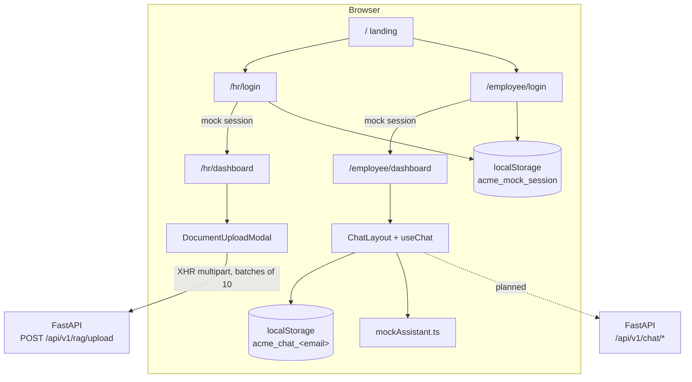

# ACME Onboard — Frontend

This is the Next.js web app for ACME Onboard. It has a public landing page, an HR portal
for uploading onboarding documents to the FastAPI backend, and an employee portal with a
chat-style onboarding assistant.

> **Implementation status**
>
> | Feature | Status |
> |---|---|
> | Landing page, mock login, HR dashboard | Done |
> | HR document upload to `POST /api/v1/rag/upload` | Done, calls the real backend |
> | Employee chat UI (conversations, Markdown, citations) | Done |
> | Employee chat answers | **Mocked.** `src/lib/chat/mockAssistant.ts` returns canned answers labelled "Demo response" |
> | Real RAG chat over the backend SSE API, with server-side history | **Planned.** The backend endpoints exist; see [SSE streaming implementation](#10-sse-streaming-implementation) |

## Table of contents

1. [Frontend overview](#1-frontend-overview)
2. [Technology stack](#2-technology-stack)
3. [Directory structure](#3-directory-structure)
4. [Application architecture](#4-application-architecture)
5. [Landing page](#5-landing-page)
6. [HR login and dashboard](#6-hr-login-and-dashboard)
7. [Employee login and chatbot](#7-employee-login-and-chatbot)
8. [Document upload components](#8-document-upload-components)
9. [API client integration](#9-api-client-integration)
10. [SSE streaming implementation](#10-sse-streaming-implementation)
11. [Conversation management](#11-conversation-management)
12. [Markdown rendering and citations](#12-markdown-rendering-and-citations)
13. [State management](#13-state-management)
14. [Styling and design system](#14-styling-and-design-system)
15. [Environment variables](#15-environment-variables)
16. [Installation](#16-installation)
17. [Development commands](#17-development-commands)
18. [Production build](#18-production-build)
19. [Testing](#19-testing)
20. [Troubleshooting](#20-troubleshooting)

---

## 1. Frontend overview

The app has two roles, both behind a demo-only mock login:

- **HR** (`@hr.com` emails) chooses one of the 13 ACME departments and uploads PDF,
  DOCX, Markdown or TXT files. The files are sent to the backend in batches of 10, and
  the app shows upload progress and a result for each file.
- **Employees** (`@acmecorp.com` emails) get a full-screen assistant with conversation
  history, suggested questions, Markdown answers and source citations.

The chat answers currently come from a local mock (see the status table above).

## 2. Technology stack

From [`package.json`](package.json):

| Area | Package |
|---|---|
| Framework | `next` 16.3.6 (App Router), `react` / `react-dom` 19.2.8 |
| Language | TypeScript 5 (strict, path alias `@/*` → `./src/*`) |
| Styling | Tailwind CSS 4 via `@tailwindcss/postcss` (CSS-first `@theme`, no `tailwind.config`) |
| Icons | `lucide-react` |
| Markdown | `react-markdown` 10 + `remark-gfm` 4 |
| Font | Inter (`next/font/google`) |
| Linting | ESLint 9 with `eslint-config-next` (core-web-vitals + typescript) |
| Package manager | npm (`package-lock.json`) |

> [`AGENTS.md`](AGENTS.md) warns that this Next.js version has breaking changes compared
> with older releases. Check `node_modules/next/dist/docs/` before relying on older APIs.

## 3. Directory structure

```text
frontend/
├── package.json, package-lock.json
├── next.config.ts            # default (empty) config
├── eslint.config.mjs, postcss.config.mjs, tsconfig.json
├── public/                   # static assets (create-next-app defaults)
└── src/
    ├── app/
    │   ├── layout.tsx        # root layout, Inter font, metadata
    │   ├── globals.css       # Tailwind import + design tokens
    │   ├── page.tsx          # landing page
    │   ├── hr/login/page.tsx
    │   ├── hr/dashboard/page.tsx
    │   ├── employee/login/page.tsx
    │   └── employee/dashboard/page.tsx
    ├── components/
    │   ├── auth/             # AuthLayout, LoginForm, ProtectedRoute (unused)
    │   ├── chat/             # ChatLayout, ChatSidebar, ChatHeader, ChatMessageList,
    │   │                     # ChatMessage, ChatComposer, ChatWelcome, SuggestedQuestions,
    │   │                     # SourceCitation, MessageActions, ChatLoadingIndicator
    │   ├── hr/               # DocumentUploadModal, DepartmentSelect, FileDropzone,
    │   │                     # SelectedFileList, UploadProgress, UploadSummary
    │   ├── landing/          # HeroSection, FeatureSection, HowItWorks
    │   ├── layout/           # Navbar, Footer
    │   └── ui/               # Button, Input, Card
    ├── hooks/useChat.ts      # chat state (useReducer)
    ├── lib/
    │   ├── auth.ts           # mock session in localStorage
    │   ├── validation.ts     # email / role-domain validation
    │   ├── api/documents.ts  # upload client (XMLHttpRequest)
    │   ├── upload/batching.ts
    │   └── chat/             # chatStorage.ts, chatUtils.ts, mockAssistant.ts
    └── types/                # auth.ts, chat.ts, documents.ts
```

## 4. Application architecture



Every page that uses the browser state is a client component. Route guards run in the
browser: each dashboard reads the session in a lazy `useState` initializer and redirects
if there is no session or the role is wrong. There is no Next.js middleware and no
server-side authentication.

## 5. Landing page

`src/app/page.tsx` renders the following:

- **`Navbar`** (sticky; hamburger menu on mobile). Links to Home and About (`/#about`),
  and buttons for HR Login and Employee Login.
- **`HeroSection`**: "Your journey at ACME starts here.", with CTAs for the Employee
  Portal and the HR Portal.
- **`FeatureSection`** (`id="about"`): three cards, Seamless Onboarding, Your Digital
  Workspace and One Connected Experience.
- **`HowItWorks`**: three steps, Sign in, Your personalized experience, and Get started
  with your team.
- **`Footer`**: only Home is a working link; the other entries are disabled placeholders.

## 6. HR login and dashboard

- **`/hr/login`** uses `AuthLayout` + `LoginForm role="hr"`.
  - The email must be valid and end with `@hr.com` (case-insensitive).
  - There is no password.
  - After a short delay the form stores `{ email, role: "hr" }` under the
    `localStorage` key `acme_mock_session` and redirects to `/hr/dashboard`.
  - The form shows a demo-only disclaimer.
- **`/hr/dashboard`**:
  - The header has a logo, an "HR Portal" badge, the email and **Sign out**, which
    clears the session.
  - The main area is a **Document Management** card with an **Upload Documents**
    button, which opens `DocumentUploadModal`.
  - The "No documents uploaded yet" empty state is static. The backend has no
    document-listing endpoint yet.

## 7. Employee login and chatbot

- **`/employee/login`** works the same way with `LoginForm role="employee"`, but the
  email must end with `@acmecorp.com`. It redirects to `/employee/dashboard`.
- **`/employee/dashboard`** mounts `ChatLayout` for the signed-in email.

| Component | Responsibility |
|---|---|
| `ChatLayout` | Full-screen shell: a 270 px sidebar (an overlay below 1023 px), the header, the welcome screen or message list, and the composer. |
| `ChatSidebar` | New Chat, search, conversations grouped by date (Today / Yesterday / Previous 7 Days / Older), inline rename, delete with confirmation, profile and sign-out. |
| `ChatHeader` | Mobile sidebar toggle, the conversation title, a "Demo" badge. |
| `ChatWelcome` / `SuggestedQuestions` | Greeting plus six suggested-question cards (two columns on desktop). |
| `ChatMessageList` | `role="log"` list that scrolls to the newest message automatically. |
| `ChatMessage` | User bubble or assistant message (Markdown, loading dots, error box, "Demo response" label for mock answers). |
| `MessageActions` | Copy, regenerate, thumbs up/down (last assistant message only). |
| `ChatComposer` | Auto-growing textarea (max 200 px). Enter sends, Shift+Enter adds a newline. |
| `SourceCitation` | Source chips (see [§12](#12-markdown-rendering-and-citations)). |
| `ChatLoadingIndicator` | Animated three-dot "typing" indicator, `role="status"`. |

## 8. Document upload components

| Component | Responsibility |
|---|---|
| `DocumentUploadModal` | Runs the upload: department and file selection, batching, progress, cancel, summary and retry. Focus is trapped inside the modal and ESC closes it; closing during an upload asks for confirmation. |
| `DepartmentSelect` | `<select>` over `DEPARTMENTS` (`src/types/documents.ts`). |
| `FileDropzone` | Drag-and-drop or browse. Validates the type (MIME, falling back to the extension) and the size. |
| `SelectedFileList` | One row per file, with its status (pending, uploading, success, error) and a remove button. |
| `UploadProgress` | Progress bar and batch counter. |
| `UploadSummary` | Totals (selected, succeeded, failed, department), **Retry failed** and close. |

**Rules** (from `src/types/documents.ts`):

- **Departments.** The 13 departments are Human Resources, IT Operations, Information
  Security, Software Engineering, AI and Machine Learning, Cloud Platform and DevOps,
  Product Management, UX and Design, Quality Engineering, Sales, Customer Support,
  Finance and Legal and Compliance. They match the backend labels exactly.
- **Accepted files.** `.pdf`, `.docx`, `.md` and `.txt`, up to 50 MB each
  (`MAX_FILE_SIZE_BYTES`). A duplicate (same name and size) is skipped.
- **Batching.** Any number of files can be selected. They are sent in sequential
  batches of `BATCH_SIZE = 10` (`createBatches` in `src/lib/upload/batching.ts`), which
  matches the backend limit of 10 files per request.
- **Progress.** Overall progress combines the batches already finished with the
  transfer progress of the current batch (`overallProgress`). It measures **upload
  transfer only**: after the bytes are sent, the backend processes the batch
  synchronously, and the UI waits for its response.
- **Results.** Each file's result comes from the response's `errors[].filename`.
  **Retry failed** re-sends only the files that failed.

## 9. API client integration

`src/lib/api/documents.ts` is the backend client used today.

```ts
const API_BASE =
  process.env.NEXT_PUBLIC_API_BASE_URL?.replace(/\/$/, '') ?? 'http://localhost:8000';
export const UPLOAD_ENDPOINT = `${API_BASE}/api/v1/rag/upload`;
```

It uses `XMLHttpRequest` rather than `fetch`, because only XHR reports upload progress
(`xhr.upload.onprogress`). Cancellation is done through an `AbortSignal`.

**Request** (multipart/form-data):

```text
POST /api/v1/rag/upload
department = "IT Operations"
files      = <file 1>
files      = <file 2>   (≤ 10 per request)
```

**Response.** The frontend type `UploadBatchResponse` reads `uploaded`, `errors` and
`message`. The backend also returns `department` and a detailed `results[]` array, which
the UI does not use yet.

```json
{
  "uploaded": 1,
  "errors": [{ "filename": "scan.pdf", "message": "PDF has no extractable text …" }],
  "message": "1 file(s) ingested, 1 failed"
}
```

**Errors:**

- On a non-2xx response the client shows the backend's string `detail`, then
  `message`, then `Server returned <status>`.
- Network errors, timeouts and aborts get their own messages.
- A 2xx response whose body isn't JSON is treated as success for the whole batch.

The Fireworks API key never reaches the browser. The frontend only knows the backend URL.

## 10. SSE streaming implementation

**Current state:** not implemented in the frontend. `src` contains no `fetch`,
`EventSource` or `ReadableStream` code. `MessageStatus` already includes `'streaming'`,
but nothing sets it yet.

**Backend contract to integrate** (implemented in the backend; see the
[backend README §23](../backend/README.md#23-sse-streaming)):

```http
POST /api/v1/chat/stream
Content-Type: application/json

{ "conversation_id": "<uuid or omit>", "employee_email": "jane@acmecorp.com", "message": "How do I set up the VPN?" }
```

The response is `text/event-stream`:

```text
event: session
data: {"conversation_id":"…","title":"…","user_message_id":"…","assistant_message_id":"…","created":true,"user_message":{…}}

event: status
data: {"stage":"retrieving","message":"Searching onboarding documents"}

event: token
data: {"text":"Install GlobalProtect "}

event: sources
data: {"sources":[{"id":"S1","title":"VPN Guide","department":"IT Operations","reference":"VPN Guide — Connecting","url":null,…}]}

event: completed
data: {"conversation_id":"…","message_id":"…","content":"…","sources":[…],"invalid_citations":[],"diagnostics":{…}}
```

On failure the stream sends `event: error` with `data: {"code":"generation_failed","message":"…"}`.

The planned client is `fetch` with `response.body.getReader()`. It needs to:

- buffer text across chunk boundaries and split frames on the blank line;
- handle each event type (`session`, `status`, `token`, `sources`, `completed`,
  `error`);
- cancel with an `AbortController`.

`EventSource` can't be used, because it only supports GET requests.

## 11. Conversation management

Today everything is client-side, in [`useChat`](src/hooks/useChat.ts) and
[`chatStorage.ts`](src/lib/chat/chatStorage.ts):

- **Storage.** Conversations are kept in `localStorage` under
  `acme_chat_<normalized email>`, so each demo account has its own history.
- **Loading.** On mount they are sorted by `updatedAt`, newest first, and the newest
  becomes active.
- **Operations.** New conversation, select, rename, delete, send, regenerate the last
  response, and thumbs feedback.
- **Titles.** A conversation is titled from its first user message (up to 60
  characters, then "…"). New conversations start as "New conversation".

The backend already provides persistent conversation CRUD
(`GET/POST /api/v1/chat`, `GET/PATCH/DELETE /api/v1/chat/{id}`, all scoped by
`employee_email`). Moving `useChat` onto those endpoints is planned. It will require
these mappings:

| Backend | Frontend |
|---|---|
| `completed` | `complete` |
| `failed` / `cancelled` | `error` |
| ISO timestamps | milliseconds |
| `SourceRef` | `SourceCitationData` |

## 12. Markdown rendering and citations

- **Markdown.** `ChatMessage` renders assistant content with `react-markdown` +
  `remark-gfm`, which supports tables, lists and code blocks. It uses custom styled
  renderers for headings, lists, blockquotes, code, tables and links. There is no
  `dangerouslySetInnerHTML`.
- **Links.** A link is rendered only when its `href` starts with `http`, `/` or
  `mailto:`; anything else becomes plain text.
- **Citations.** `SourceCitation` renders a **Sources** row with one chip per
  `SourceCitationData { id, title, department, reference, url? }`. Each chip shows a file
  icon, the title and `department · reference`. It adds an external-link icon that
  opens in a new tab only when `url` is present. The backend sets `url` only for real
  links, and the mock sources have none.

## 13. State management

There is no external state library.

- **Chat.** `useChat` uses `useReducer` with the actions `INIT`, `SET_ACTIVE`,
  `ADD_CONVERSATION`, `UPDATE_CONVERSATION`, `DELETE_CONVERSATION`, `SET_LOADING` and
  `SET_ERROR`.
  - A `stateRef`, synced in an effect, gives async callbacks the latest state.
  - Sending adds the user message and a pending assistant placeholder right away, then
    replaces the placeholder with the answer.
- **Upload.** `DocumentUploadModal` keeps its own `useState` values (files, phase,
  progress, batch index) and an `AbortController`.
- **Session.** `src/lib/auth.ts` provides `setSession`, `getSession`, `clearSession` and
  `hasRole`, stored under the `localStorage` key `acme_mock_session`.

## 14. Styling and design system

The app uses a dark navy enterprise theme. Tokens are defined in
[`src/app/globals.css`](src/app/globals.css) with Tailwind 4 `@theme inline`:

| Token | Hex | Use |
|---|---|---|
| `--color-background` | `#081426` | page background |
| `--color-bg-secondary` | `#0F2138` | inputs, secondary surfaces |
| `--color-bg-card` | `#142B45` | cards, panels |
| `--color-accent` | `#38BDF8` | primary actions, focus rings, highlights |
| `--color-text-primary` | `#F8FAFC` | main text |
| `--color-text-secondary` | `#94A3B8` | secondary text |
| `--color-border` | `#28415D` | borders |

Components also use `#7DD3FA` (accent hover), `#1B3653` (hover surface) and `#1B3A58`
(user chat bubble), plus Tailwind `red-*` and `green-*` for errors and success. Most
components write these colours as arbitrary values such as `bg-[#081426]` instead of
using the token names. The font is Inter (`--font-inter`).

**UI primitives** (`src/components/ui/`):

- **`Button`**: variants `primary`, `secondary` (outlined) and `ghost`; sizes `sm`, `md`
  and `lg`; `fullWidth`.
- **`Input`**: label, error text, `aria-invalid` and `aria-describedby`.
- **`Card`**: rounded bordered panel with an optional accent border on hover.

## 15. Environment variables

| Variable | Default | Purpose |
|---|---|---|
| `NEXT_PUBLIC_API_BASE_URL` | `http://localhost:8000` | FastAPI base URL (trailing slash removed) |

This is the only environment variable the code reads. The repository has no
`.env.example`, and `.gitignore` ignores all `.env*` files. To set the variable, create
`frontend/.env.local`:

```bash
NEXT_PUBLIC_API_BASE_URL=http://localhost:8000
```

`NEXT_PUBLIC_*` values are embedded in the browser bundle, so **never** put secrets such
as the Fireworks key in them. The key belongs only in `backend/.env`. On Vercel, set the
variable in the project dashboard; `.vercelignore` excludes local `.env*` files.

## 16. Installation

```bash
cd frontend
npm install
```

Node.js with npm is required; Next.js 16 needs Node ≥ 20.9.

## 17. Development commands

```bash
npm run dev     # http://localhost:3000
npm run lint    # ESLint
npx tsc --noEmit  # type-check (no script defined for it)
```

For uploads to work, run the backend on port 8000 with `CORS_ORIGINS` including
`http://localhost:3000` (the default). See the [backend README](../backend/README.md).

## 18. Production build

```bash
npm run build
npm run start   # serves the production build on port 3000
```

## 19. Testing

No test framework (Jest, Vitest or Playwright) is configured, and `package.json` has no
`test` script. The available checks are `npm run lint`, `npx tsc --noEmit` and
`npm run build`.

To test manually:

1. Sign in at `/hr/login` with any `@hr.com` email and upload a small fictional document.
2. Sign in at `/employee/login` with any `@acmecorp.com` email and use the (mock) chat.

## 20. Troubleshooting

| Symptom | Fix |
|---|---|
| Upload fails with a network error | Check that the backend is running at `NEXT_PUBLIC_API_BASE_URL` and that `CORS_ORIGINS` includes your frontend origin. |
| Upload returns "embedding service is not configured" | Set `FIREWORKS_API_KEY` in `backend/.env` and restart the backend. |
| `.env.local` change has no effect | `NEXT_PUBLIC_*` values are inlined when the app is built or started. Restart `npm run dev` or rebuild. |
| Redirected back to a login page | No mock session, or the wrong role for this dashboard. Sign in with the matching email domain. |
| Chat answers say "Demo response" | This is expected: chat is still mocked. |
| Old chats missing | Chats are in the browser's `localStorage` for each email. Clearing site data removes them. |
